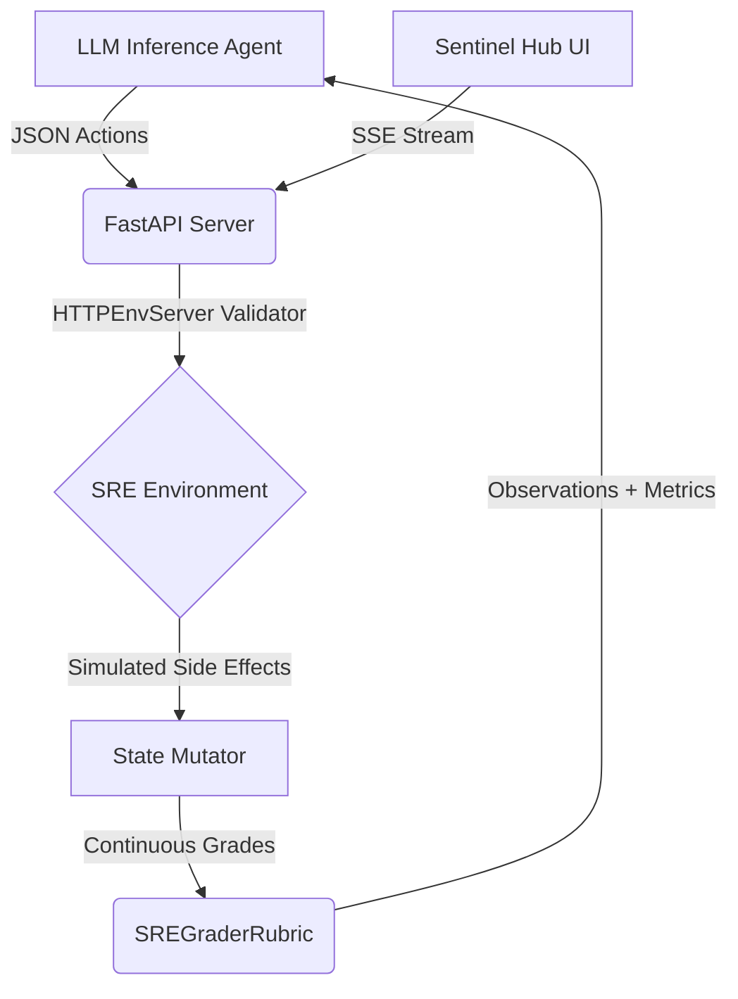

# 🛡️ Sentinel-SRE-OpenEnv: Autonomous Incident Response
[](https://www.python.org/downloads/release/python-3110/)
[](https://github.com/facebookresearch/openenv)
[](LICENSE)
[](https://github.com/astral-sh/ruff)

> **Live Demo:** [https://huggingface.co/spaces/jay2219/sre-incident-env](https://huggingface.co/spaces/jay2219/sre-incident-env)

A production-grade **Site Reliability Engineering (SRE)** Reinforcement Learning environment built on the **Meta OpenEnv** framework. Sentinel-SRE simulates catastrophic infrastructure failures to train and evaluate LLM agents on autonomous incident response. It features dense composite rewards, four escalating incident tiers, an LLM-powered **Dynamic Chaos Generator**, and a real-time **Sentinel Hub** dashboard for live agent observation.

---

## 📖 Table of Contents
- [Architecture](#-architecture)
- [Project Structure](#-project-structure)
- [Incident Topology](#-incident-topology-tiers)
- [Action / Observation / State Spaces](#-action--observation--state-spaces)
- [Interactive Dashboard](#-interactive-dashboard-sentinel-hub)
- [Getting Started](#-getting-started)
- [Docker Deployment](#-docker-deployment)
- [Testing & Linting](#-testing--linting)
- [Evaluation & Grading](#-evaluation--grading-rubrics)

---

## 🏗️ Architecture

The repository adheres to Meta's RFC-004 standard for distributed AI environments.



- **API Layer:** `HTTPEnvServer` running on FastAPI + Uvicorn.
- **Schemas:** Pydantic type-safe validation for `Action`, `Observation`, and `State`.
- **Evaluation:** Proportional grader extracted into `openenv.core.rubrics.base.Rubric`.
- **Dashboard:** Real-time SSE-powered UI for live agent observation.
- **Infrastructure:** Docker container optimised for Hugging Face Spaces CPU Basic tier.

---

## 📂 Project Structure

```
Sentinel-SRE-OpenEnv/
├── server/                        # FastAPI Environment Server
│   ├── api/
│   │   └── routes/
│   │       ├── agent.py           # SSE endpoint for live agent streaming
│   │       └── environment.py     # /custom_reset for dynamic chaos injection
│   ├── core/
│   │   └── deps.py                # Singleton environment & OpenEnv wiring
│   ├── schemas/
│   │   └── reset.py               # Pydantic request models
│   ├── static/
│   │   └── style.css              # Sentinel Hub design system
│   ├── templates/
│   │   └── index.html             # Interactive dashboard UI
│   ├── app.py                     # FastAPI entry point
│   ├── environment.py             # Core SRE simulation logic
│   └── rubrics.py                 # Episodic grader (0.0 → 1.0)
│
├── sre_env/                       # Agent Client Package
│   ├── constants/
│   │   └── prompts.py             # LLM system prompts
│   ├── core/
│   │   └── client.py              # HTTP client for reset/step API calls
│   ├── utils/
│   │   └── parser.py              # JSON extraction from LLM output
│   ├── tests/
│   │   └── test_environment.py    # Automated environment validation
│   ├── models.py                  # Action, Observation, State schemas
│   └── inference.py               # CLI-based agent runner
│
├── Dockerfile                     # Production container
├── openenv.yaml                   # OpenEnv manifest
├── pyproject.toml                 # Dependencies & tooling config
└── README.md
```

---

## 🔥 Incident Topology (Tiers)

The environment challenges agents with four escalating scenarios plus a dynamic mode:

| Difficulty | Incident | Expected Workflow | Grader Metric |
|---|---|---|---|
| 🟢 **Easy** | OOMKilled Pod Alert | `diagnose` → `restart_pod` | Cluster uptime restoration |
| 🟡 **Medium** | High DB Latency (12,000ms) | `diagnose` → `run_sql` | Latency reduction ratio |
| 🔴 **Hard** | 50,000 RPS Traffic Spike | `diagnose` → `scale_servers` | Traffic absorbed under $500 budget |
| 💀 **Extreme** | Bad Code Deployment | `diagnose` → `check_logs` → `rollback` | Total resolution time |
| 🧠 **Dynamic** | User-Defined Incident | *Auto-mapped to archetype* | *Matches archetype grader* |

### 🧠 Dynamic Chaos Generator
Accepts free-text natural language prompts (e.g., *"My checkout service is timing out due to slow database queries"*) and uses an LLM-based **Incident Router** to classify them into solvable archetypes. Custom logs and descriptions are generated dynamically while preserving grading integrity.

---

## 📐 Action / Observation / State Spaces

### Action Space (`SREAction`)
Agents submit structured JSON commands:

```json
{
  "command_type": "restart_pod | run_sql | scale_servers | diagnose | check_logs | rollback | noop",
  "target_resource": "<resource_id>",
  "parameters": {}
}
```

| Command | Target Example | Parameters |
|---|---|---|
| `diagnose` | `system` | — |
| `restart_pod` | `pod-web-3` | — |
| `run_sql` | `orders_table` | `{"sql": "CREATE INDEX ..."}` |
| `scale_servers` | `cluster` | `{"replicas": 5}` |
| `check_logs` | `auth-service` | — |
| `rollback` | `auth-service` | `{"revision": "v1.4.2"}` |

### Observation Space (`SREObservation`)
Each step returns:

| Field | Type | Description |
|---|---|---|
| `message` | `str` | Human-readable status of the incident |
| `logs` | `list[str]` | Simulated terminal/system log lines |
| `success` | `bool` | Whether the last action succeeded |
| `metrics` | `SystemMetrics` | CPU, memory, latency, uptime, error rate, budget |
| `available_actions` | `list[str]` | Contextually valid commands |
| `task_description` | `str` | Active incident description |
| `reward` | `float` | Step reward (dense, composite) |
| `done` | `bool` | Whether the episode has terminated |

### State (`SREState`)
Internal episode state tracked by the environment:

| Field | Type | Description |
|---|---|---|
| `task_difficulty` | `enum` | `easy / medium / hard / extreme` |
| `current_uptime` | `float` | Service uptime ratio `[0.0, 1.0]` |
| `budget_remaining` | `float` | Remaining cloud budget in USD |
| `incident_resolved` | `bool` | Whether the root incident is fixed |
| `root_cause_found` | `bool` | Whether the agent has diagnosed the cause |
| `total_reward` | `float` | Cumulative reward for the episode |

---

## 🖥️ Interactive Dashboard (Sentinel Hub)

The environment ships with a **real-time web dashboard** accessible at the root URL (`/`). Judges and users can:

1. **Select a scenario** from 4 pre-built incident tiers (Easy → Extreme).
2. **Type a custom incident** for dynamic LLM-powered chaos generation.
3. **Click "Run Agent"** and watch the autonomous agent resolve the incident live via Server-Sent Events (SSE).
4. **Monitor live stats** — Uptime, Budget, Steps, and Final Grade update in real-time.

The dashboard streams every LLM thought, action, environment response, and reward directly to the browser.

---

## 🚀 Getting Started

### 1. Clone & Install
```bash
git clone https://github.com/Jay2219/Sentinel-SRE-OpenEnv.git
cd Sentinel-SRE-OpenEnv

# Install all dependencies
uv sync
```

### 2. Configure Environment Variables
Create a `.env` file in `server/` (or set them as system environment variables):
```bash
HF_TOKEN=hf_your_token_here
MODEL_NAME=meta-llama/Meta-Llama-3-8B-Instruct
API_BASE_URL=https://router.huggingface.co/v1
ENV_BASE_URL=http://localhost:8000
```

### 3. Start the Server
```bash
uv run server/app.py
```
The server is now running at `http://localhost:8000`. Visit `/` for the dashboard, `/docs` for Swagger.

### 4. Run the CLI Agent (Optional)
In a separate terminal:
```bash
# Windows PowerShell
$env:PYTHONPATH="."; uv run sre_env/inference.py

# Linux / macOS
PYTHONPATH=. uv run sre_env/inference.py
```

---

## 🐳 Docker Deployment

Build and run the production container:
```bash
# Build the image
docker build -t sentinel-sre .

# Run with environment variables
docker run -p 8000:8000 \
  -e HF_TOKEN=hf_your_token \
  -e MODEL_NAME=meta-llama/Meta-Llama-3-8B-Instruct \
  -e API_BASE_URL=https://router.huggingface.co/v1 \
  sentinel-sre
```

The container includes a `HEALTHCHECK` that pings `/health` every 30 seconds.

---

## 🛠️ Testing & Linting

### Automated Tests
Validate the environment logic across all 4 difficulty tiers:
```bash
# Windows PowerShell
$env:PYTHONPATH="."; uv run pytest sre_env/tests/ -v

# Linux / macOS
PYTHONPATH=. uv run pytest sre_env/tests/ -v
```

### Code Quality (Ruff)
```bash
# Scan for errors
uv run ruff check .

# Auto-format codebase
uv run ruff format .
```

---

## ⚖️ Evaluation & Grading (Rubrics)

The `SREGraderRubric` computes a continuous episodic score `[0.0, 1.0]` based on:

| Criterion | Weight | Description |
|---|---|---|
| **Resolution Speed** | High | Inversely proportional to step count |
| **Budget Efficiency** | Medium | Penalties for wasteful cloud spending (Hard tier) |
| **Collateral Damage** | Severe | Restarting healthy pods or running rogue SQL incurs heavy penalties |
| **Root Cause Diagnosis** | Required | Agents must `diagnose` before corrective actions are effective |

The reward signal is **dense and composite** — agents receive feedback at every step, not just at episode termination.

---

## 📜 License

This project is licensed under the [MIT License](LICENSE).

---

*Built for the 2026 Meta PyTorch × Scaler OpenEnv AI Hackathon.*
