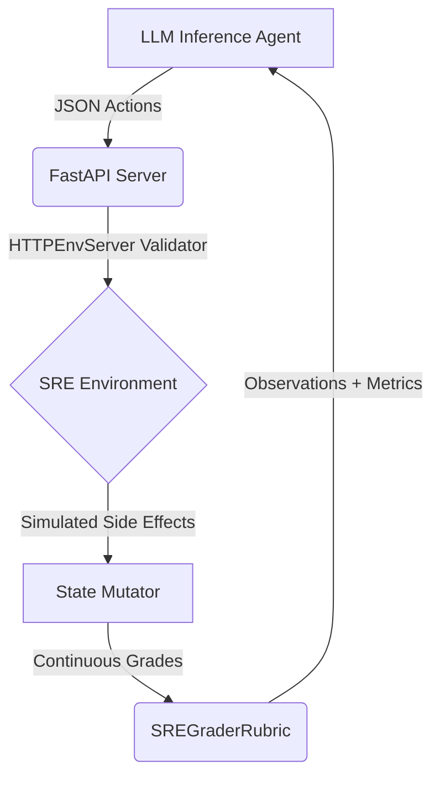

# 🛡️ Sentinel-SRE-OpenEnv: Autonomous Incident Response
[](https://www.python.org/downloads/release/python-3110/)
[](https://github.com/facebookresearch/openenv)
[](LICENSE)
[](https://github.com/astral-sh/ruff)

A production-grade Site Reliability Engineering (SRE) Reinforcement Learning environment built on the **Meta OpenEnv** framework. 

**Sentinel-SRE** simulates catastrophic infrastructure failures to evaluate LLM agents on their ability to act as autonomous SREs. It features a dense reward system, multiple static incident tiers, and a first-of-its-kind **Dynamic Chaos Generator**.

---

## 🏗️ Architecture

The repository adheres to Meta's RFC-004 standard for distributed AI environments.



---

## 🔥 Incident Topology (Tiers)

The environment challenges the agent with escalating scenarios:

| Difficulty | Incident Scenario | Primary Diagnostic Tool | Grader Metric |
|---|---|---|---|
| 🟢 **Easy** | **OOMKilled Pod Alert** | `diagnose` | Restored cluster uptime. |
| 🟡 **Medium** | **High DB Latency (12,000ms)** | `run_sql` | Database latency reduction. |
| 🔴 **Hard** | **Sudden Traffic Spike (10×)** | `scale_servers` | Time to absorb traffic (Budget: $500). |
| 💀 **Extreme** | **Bad Code Deployment** | `rollback` | Total resolution step/time. |
| 🧠 **Dynamic** | **User-Defined SRE Incident** | *Matches Archetype* | *Matches Archetype* |

### 🧠 Featured: Dynamic Chaos Generator (Option 5)
Leverage an **SRE Incident Router** (LLM) to classify free-text natural language prompts into solvable incident archetypes. Submit any problem (e.g., *"My checkout service is timing out due to slow database queries"*) and the environment will dynamically generate matching logs and descriptions while maintaining mathematical evaluation integrity.

---

## 🚀 Getting Started

### 1. Prerequisites
We use [`uv`](https://docs.astral.sh/uv/) for incredibly fast dependency management.
```bash
# Install environment & dependencies
uv sync
```

### 2. Local Server Deployment
Start the OpenEnv FastAPI layer:
```bash
uv run server/app.py
```
*The server is now listening for OpenEnv schema actions on `http://localhost:8000`.*

### 3. Run the Sentinel-SRE Agent
To test the environment natively, run the interactive inference script:
```bash
# Set your API key
export HF_TOKEN="your_key"

# Execute the agent loop
uv run sre_env/inference.py
```

---

## 🛠️ Testing & Linting

### Automated Validation (Tests)
Ensure the environment math is sound before submission:
```bash
# Execute the core test suite (Windows PowerShell)
$env:PYTHONPATH="."; uv run pytest sre_env/tests/

# Execute the core test suite (Linux/MacOS)
PYTHONPATH=. uv run pytest sre_env/tests/
```

### Quality Assurance (Linting)
Sentinel-SRE is built with industrial-grade linting standards:
```bash
# Scan for errors
uv run ruff check .

# Auto-format codebase
uv run ruff format .
```

---

## ⚖️ Evaluation & Grading
The `SREGraderRubric` computes continuous floats `[0.0, 1.0]` based on:
1. **Resolution Speed:** Rewards the fastest fix.
2. **Budget Efficiency:** Penalties for wasteful cloud spending.
3. **Collateral Damage:** Severe penalties for terminating healthy services or executing rogue production SQL without cause.

Built for the 2026 OpenEnv AI Hackathon.
